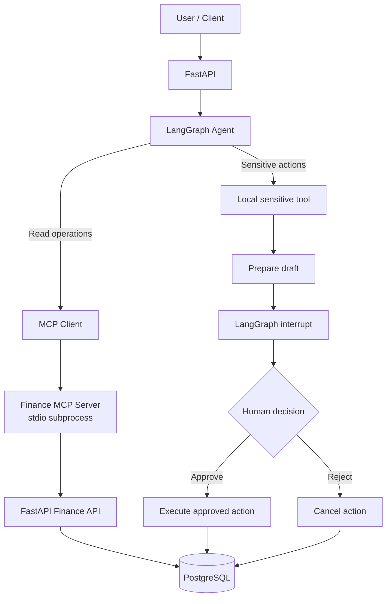
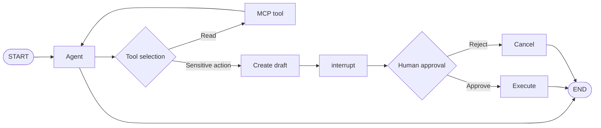
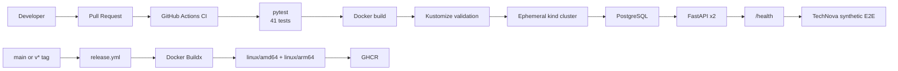

# Finance AI Agent

> Production-style agentic AI system for finance operations built with LangGraph, MCP, FastAPI, PostgreSQL, Docker and Kubernetes.

[](https://github.com/CerenDc/finance-ai-agent/actions/workflows/ci.yml)


## Overview

Finance AI Agent lets users query finance data and request operational actions through a LangGraph-based conversational agent. Read-only capabilities are discovered from a Finance MCP server and invoked through the Model Context Protocol. Sensitive actions, such as sending a payment reminder, remain local to the agent and require explicit human approval. PostgreSQL stores both business data and durable LangGraph checkpoints, so conversations and approval interrupts survive API restarts. FastAPI exposes the finance and agent interfaces as a containerized, Kubernetes-tested service.

## What this project demonstrates

- Agent orchestration with LangGraph
- Tool interoperability with Model Context Protocol (MCP)
- Human-in-the-loop control for sensitive actions
- Persistent agent state and checkpoints with PostgreSQL
- A production-oriented FastAPI service
- Docker containerization and Docker Compose workflows
- Kubernetes deployment, health probes, persistence and scaling
- Automated unit, integration and end-to-end testing
- CI/CD with GitHub Actions
- Multi-architecture container publishing to GHCR

## Architecture



The Finance MCP server is not a separate Kubernetes microservice. It runs as a `stdio` subprocess inside each API workload, matching the application architecture used by Docker Compose and the two-replica Kubernetes deployment.

## Agent flow



## Example use cases

The demo intentionally uses French business queries to illustrate how the agent
can operate in a French-speaking finance environment. The underlying architecture,
tools and APIs are language-agnostic.

All names, invoices and amounts below are synthetic demonstration data. **TechNova is not a real customer.**

```text
User:     Combien TechNova nous doit-il ?
Expected: TechNova nous doit 5 800 € au titre de 2 factures impayées.
```

This read request follows the MCP path from LangGraph to the Finance API and PostgreSQL.

```text
User: Envoie une relance de paiement pour la facture INV-001

Agent → draft → approval_required → human decision → send or cancel
```

The reminder endpoint simulates the external send, but the approval boundary is real: execution is unreachable until the persisted LangGraph interrupt is explicitly approved.

### English query example

The conversational layer can also handle equivalent English requests.

```text
User:     How much does TechNova owe us?
Expected: TechNova owes us €5,800 across 2 unpaid invoices.
```

## Tech stack

| Area | Technology |
| --- | --- |
| Agent orchestration | LangGraph / LangChain |
| Tool protocol | Model Context Protocol (MCP) |
| API | FastAPI |
| Database | PostgreSQL |
| Persistence | AsyncPostgresSaver |
| Containerization | Docker / Docker Compose |
| Orchestration | Kubernetes / kind / Kustomize |
| Testing | pytest |
| CI/CD | GitHub Actions |
| Container registry | GitHub Container Registry (GHCR) |
| Language | Python 3.13 |

## MCP and governance

The Finance MCP server exposes six read-only tools:

- `get_customers`
- `get_invoices`
- `get_overdue_invoices`
- `get_customer_balance`
- `get_invoice`
- `get_company_kpis`

Sensitive capabilities deliberately remain local and are not exposed through MCP:

- `create_payment_reminder`
- `send_payment_reminder`

This hybrid registry separates interoperable read access from business actions with side effects. It also keeps the human-approval policy close to the sensitive implementation rather than delegating that policy to an external tool server.

## Human in the loop

```text
LLM requests sensitive action
→ draft prepared
→ LangGraph interrupt()
→ checkpoint persisted in PostgreSQL
→ human approve/reject
→ execution only after approval
```

The PostgreSQL checkpoint allows the same action to resume with its original `thread_id`, including after an API restart. Rejection cancels the action without calling the simulated send endpoint.

## Production-oriented CI/CD



The release workflow reruns the complete CI before publishing. Kubernetes integration uses a disposable kind cluster, waits for the database setup Job and both API replicas, then removes the cluster even if the run fails.

## Validated release

| Item | Validated value |
| --- | --- |
| Version | `v8.1.0` |
| Tests | 41 passed |
| Kubernetes API replicas | 2/2 |
| Platforms | `linux/amd64`, `linux/arm64` |
| Registry | `ghcr.io/cerendc/finance-ai-agent` |
| CI | Passing |

## Testing without external LLM calls

Docker and Kubernetes end-to-end tests replace only the external model with `SyntheticFinanceLLM`. The rest of the path remains real:

```text
HTTP → LangGraph → MCP stdio → Finance API → PostgreSQL
```

The deterministic model selects `get_customer_balance`, verifies the synthetic TechNova result and produces the expected answer. No demonstration content is sent to OpenAI during CI, while MCP discovery, tool execution, HTTP routing, database access and checkpointing remain covered.

## Quick start

The recommended reproducible demo uses Docker Compose with the synthetic LLM, so no OpenAI key is required:

```bash
cp .env.example .env
docker compose -f compose.yaml -f compose.test.yaml up -d --build
docker compose -f compose.yaml -f compose.test.yaml ps
```

Test the service:

```bash
curl http://localhost:8000/health

curl -X POST http://localhost:8000/agent/chat \
  -H 'Content-Type: application/json' \
  -d '{
    "thread_id": "portfolio-demo",
    "message": "Combien TechNova nous doit-il ?"
  }'
```

Stop the demo while preserving the PostgreSQL volume:

```bash
docker compose -f compose.yaml -f compose.test.yaml down
```

For local Python setup, persistent approval flows, MCP inspection, Kubernetes deployment, GHCR usage and cleanup procedures, see the [technical guide](docs/technical-guide.md).

## Project structure

```text
finance-ai-agent/
├── app/
│   ├── agent/          # LangGraph orchestration and PostgreSQL checkpointer
│   ├── api/            # FastAPI finance and agent routes
│   ├── db/             # SQLAlchemy models, seed and database access
│   ├── mcp/            # Finance MCP stdio server
│   └── tools/          # MCP-facing and sensitive local tools
├── tests/              # Unit/API tests and deterministic E2E model
├── k8s/                # Kustomize base and synthetic test overlay
├── docs/               # Detailed technical documentation
├── .github/workflows/  # CI and multi-architecture GHCR release
├── Dockerfile
├── Dockerfile.test
├── compose.yaml
└── compose.test.yaml
```

## Detailed technical documentation

The [technical guide](docs/technical-guide.md) contains the complete local, MCP, LangGraph, FastAPI, Docker Compose, Kubernetes, testing and CI/CD procedures retained from the project milestones.

## Roadmap

Possible future extensions, not current features:

- Terraform and cloud infrastructure
- Observability with Prometheus and Grafana
- Hardened Kubernetes security and RBAC
